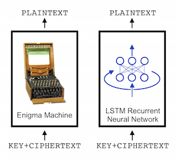

`crypto-rnn`: Learning the Enigma with Recurrent Neural Networks
=======
See [paper](https://arxiv.org/abs/1708.07576) and [blog post](https://greydanus.github.io/2017/01/07/enigma-rnn/)



About
--------
This repo contains a deep LSTM-based model for learning polyalphabetic ciphers. It also contains code for training the model on three ciphers: the Vigenere, Autokey, and Enigma ciphers. The first two are light proof-of-concept tasks whereas the Enigma is much more complex. For this reason, the Enigma model is enormous (3000 hidden units) and takes a lot longer to train.

Vigenere and Autokey ciphers
--------
The [Vigenere cipher](https://en.wikipedia.org/wiki/Vigen%C3%A8re_cipher) works like this (where we're encrypting plaintext "CALCUL" with keyword "MATHS" (repeated)). The [Autokey cipher](https://en.wikipedia.org/wiki/Autokey_cipher) is a slightly more secure variant.


Enigma cipher
--------
The [Enigma cipher](https://en.wikipedia.org/wiki/Enigma_machine) works like this.


Dependencies
--------
* All code is written in Python 3.6 and TensorFlow 1.1. You will need:
 * NumPy
 * [TensorFlow](https://www.tensorflow.org/install/)

Docker
--------
```console
foo@bar:~$ docker build -t crypto-rnn .  # Build context
...
foo@bar:~$ docker run -v $(pwd):/opt/app --entypoint=/bin/bash -it --rm crypto-rnn # Real time dev
docker@shell:~$ exit
exit
foo@bar:~$ docker run -it --rm crypto-rnn # Just RUN
===== COUNTING MODEL PARAMETERS =====
Model overview:
        variable "model/W_fc1:0" has 6912 parameters
        variable "model/model_cell0/lstm_cell/kernel:0" has 289792 parameters
        variable "model/model_cell0/lstm_cell/bias:0" has 1024 parameters
Total of 297728 parameters
=====================================

no saved model to load. starting new session
        resetting log files...
training...
        step:     100 | loss: 46.234 | data time: 0.0073 sec | rnn time: 0.1224 sec | total time: 0.1297 sec
...
```
