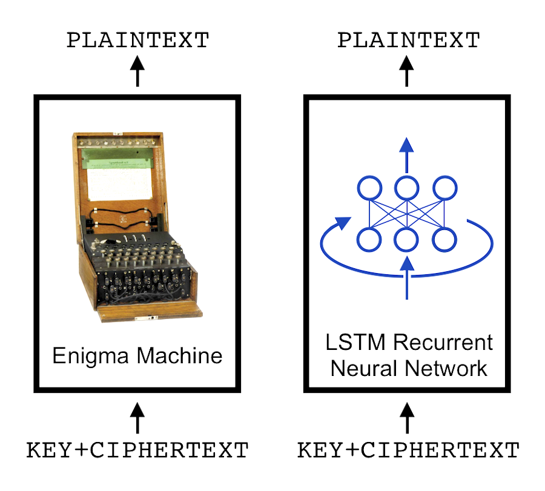

`crypto-rnn`: Learning the Enigma with Recurrent Neural Networks
=======
See [paper]() and [blog post](https://greydanus.github.io/2017/01/07/enigma-rnn/)

About
--------
This repo contains a deep LSTM-based model for learning polyalphabetic ciphers. It also contains code for training the model on three ciphers: the Vigenere, Autokey, and Enigma ciphers. The first two are light proof-of-concept tasks whereas the Enigma is much more complex. For this reason, the Enigma model is enormous (3000 hidden units) and takes a lot longer to train.

Vigenere and Autokey ciphers
--------
The [Vigenere cipher](https://en.wikipedia.org/wiki/Vigen%C3%A8re_cipher) works like this (where we're encrypting plaintext "CALCUL" with keyword "MATHS" (repeated)). The [Autokey cipher](https://en.wikipedia.org/wiki/Autokey_cipher) is a slightly more secure variant.

Enigma cipher
--------
The [Enigma cipher](https://en.wikipedia.org/wiki/Enigma_machine) works like this.

Dependencies
--------
* All code is written in Python 3.6 and TensorFlow 1.1. You will need:
 * NumPy
 * [TensorFlow](https://www.tensorflow.org/install/)
